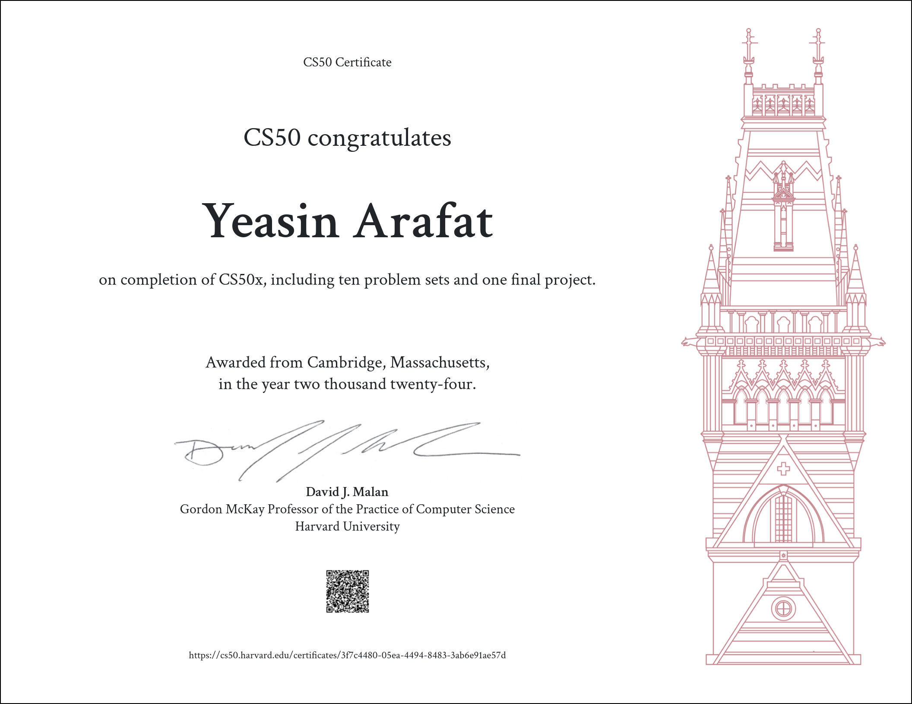

<h1 align="center">Hi 👋, I'm Yeasin Arafat</h1>
<h2 align="center">A broad and robust understanding of computer science and programming.
                   How to think algorithmically and solve programming problems efficiently.
                   Concepts like abstraction, algorithms, data structures, encapsulation, resource management, security, software engineering, and web development.
                   Familiarity in a number of languages, including C, Python, SQL, and JavaScript plus CSS and HTML.
                   How to engage with a vibrant community of like-minded learners from all levels of experience.
                   How to develop and present a final programming project to your peers.</h2>

<h3 align="center">CS50's Introduction to Computer Science</h3>

<h3 align="center">Associated skills:Finance, JavaScript (Programming Language), Algorithms, Security Software, Forensic Sciences, Data Structures, C (Programming Language), Computer Science, Resource Management, SQL (Programming Language), Cascading Style Sheets (CSS), HyperText Markup Language (HTML), Cryptography,Python (Programming Language)</h3>

